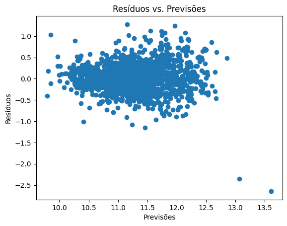
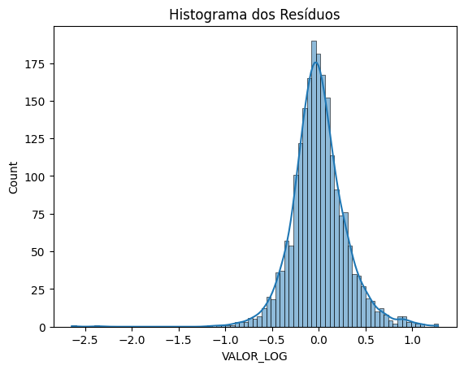

<p align="center">

</p>

# Scrape dos Dados Anuncios de Veiculos do MercadoLivre e Predição dos valores de Vendas.

## Descrição

Este projeto realiza web scraping de anúncios de veículos no Mercado Livre e prevê valores de vendas usando um modelo de machine learning. O projeto é dividido em várias partes, incluindo coleta de dados, transformação de dados, análise exploratória e predição de preços.

Etapas do projeto:

- [x] Scrape dos dados
- [x] Tratamento e armazenamento em um banco de dados
- [x] EDA
- [x] Modelagem
- [x] Deploy Streamlit

## Principais Tecnologias Utilizadas

- ``Python 3.12.1``
- ``SQLite3``
- ``Streamlit``
- ``Pandas``
- ``Numpy``
- ``Matplotlib``
- ``Seaborn``
- ``Regex``
- ``Scrapy``
- ``scikit-learn``

## 📁 Acesso aos do  arquivos projeto
Você pode acessar os arquivos do projeto:

Scrape dos dados: [Mercadolivre.py](https://github.com/RailanDeivid/MercadoLivre_Scraper_and_CarPricePredictor/blob/main/src/scraper/spiders/mercadolivre.py)

Transformações dos dados: [main.py](https://github.com/RailanDeivid/MercadoLivre_Scraper_and_CarPricePredictor/blob/main/src/data_transformation/main.py)

Analises dos dados: [EDA.ipynb](https://github.com/RailanDeivid/MercadoLivre_Scraper_and_CarPricePredictor/blob/main/src/analysis/EDA.ipynb)

Modelagem: [modelagemipynb](https://github.com/RailanDeivid/MercadoLivre_Scraper_and_CarPricePredictor/blob/main/src/modelagem/modelagem.ipynb)

Dados: [data](https://github.com/RailanDeivid/MercadoLivre_Scraper_and_CarPricePredictor/tree/main/data)

#  Scraper dos dados
Foi utilizada a biblioteca ``Scrapy`` para obter os dados dos anuncios de veiculos do Mercado Livre. Os registros são obtidos pelo script [Mercadolivre.py](https://github.com/RailanDeivid/MercadoLivre_Scraper_and_CarPricePredictor/blob/main/src/scraper/spiders/mercadolivre.py) Onde é feito a raspagem, entrando e cada um dos 49 anuncios por pagina e pegando as informações de cado anuncio, anuncios por marca e estado.
Um trecho do código utilizado:
```
class MercadolivreSpider(scrapy.Spider):
    name = "mercadolivre"
    
    lista_marcas = ['volkswagen', 'chevrolet', 'ford', 'hyundai', 'fiat', 'renault', 'honda', 'jeep', 'nissan', 'audi', 'bmh', 
                    'chery', 'citroen', 'dodge', 'jac', 'jaguar', 'kia', 'lexus', 'mini', 'mercedes-benz', 'land-rover', 'lifan',
                    'peugeot', 'subaru', 'suzuki', 'toyota', 'volvo']
    
    listas_UF = ['ceara', 'distrito-federal', 'goias', 'mato-grosso', 'minas-gerais', 'parana', 'para', 'pernambuco', 
                 'rio-de-janeiro', 'sao-paulo', 'santa-catarina', 'rio-grande-do-sul', 'tocantins', 'alagoa', 'amazonas', 'goias', 
                 'bahia','maranhao', 'mato-grosso-do-sul', 'piaui', 'paraiba', 'rio-grande-do-norte', 'sergipe', 'espirito-santo']

    start_urls = []

    def __init__(self):
        for marca in self.lista_marcas:
            for uf in self.listas_UF:
                url = f"https://lista.mercadolivre.com.br/veiculos/carros-caminhonetes/{marca}-em-{uf}/"
                self.start_urls.append(url)
    
    page_count = 1
    max_pages = 42

    def parse(self, response):
        anuncios = response.css('div.ui-search-result__content')
        url_parts = response.url.split('/')
        marca = url_parts[-2].split('-')[0]
        uf = '-'.join(url_parts[-2].split('-')[2:])
        # marca = response.url.split('/')[-2].split('-')[0]
        # uf = response.url.split('/')[-2].split('-')[2]

        for anuncio in anuncios:
            data_coleta = datetime.now().date()
            link = anuncio.css('a.ui-search-link::attr(href)').get()
            local = anuncio.css('span.ui-search-item__group__element.ui-search-item__location::text').get()
            if link:
                yield response.follow(link, self.parse_anuncio, meta={'link': link, 'local': local, 'data_coleta': data_coleta, 'marca': marca, 'uf': uf})

        if self.page_count <= self.max_pages:
            next_page = response.css('li.andes-pagination__button.andes-pagination__button--next a::attr(href)').get()
            if next_page:
                self.page_count += 1
                yield scrapy.Request(url=next_page, callback=self.parse)
```

Os dados são salvos em um arquivos  [jsonl](https://github.com/RailanDeivid/MercadoLivre_Scraper_and_CarPricePredictor/tree/main/data)

#  Tratamento dos dados


Os tratamentos dos dados foram feitos no arquivo [main.py](https://github.com/RailanDeivid/MercadoLivre_Scraper_and_CarPricePredictor/blob/main/src/data_transformation/main.py) onde é feito todos os tratamentos possiveis e o armazenamento em um banco de dados [SQLite](https://github.com/RailanDeivid/MercadoLivre_Scraper_and_CarPricePredictor/tree/main/data). 


#  Análise Exploratória de Dados (EDA)

<h3 align="center"> 
    ⚠️ Apenas um trecho das analises feitas  ⚠️
</h3>

As seguintes bibliotecas foram importadas para a análise:

- ``warnings`` para ignorar avisos
- ``pandas`` e ``numpy`` para manipulação de dados
- ``matplotlib`` e ``seaborn`` para visualização de dados
- ``sqlite3`` para conexão com o banco de dados
- ``os`` para manipulação de caminhos de arquivos

### Analise Descritivas
Criação de histogramas para as variáveis numéricas: valor, ano e KM, para observar a distribuição dos dados.


Os gráficos representam a distribuição de frequência de três variáveis numéricas: valor, ano e KM.

1. Distribuição de valor:

O histograma mostra que a distribuição do valor é assimétrica à direita, com uma maior concentração de dados nos valores mais baixos.

2. Distribuição de ano:

O histograma do ano mostra uma distribuição aproximadamente normal, com uma maior concentração de dados em torno do ano 2000.
A curva KDE confirma a normalidade, com uma curva simétrica em torno do ano 2000.
O ano mínimo é de aproximadamente 1970, enquanto o ano máximo é de aproximadamente 2020.

3. Distribuição de KM:

O histograma do KM mostra uma distribuição assimétrica à direita, com uma maior concentração de dados nos valores mais baixos.
Também podemos confirmar com a curva KDE a assimetria.
O KM mínimo é de aproximadamente 0, enquanto o KM máximo é de aproximadamente 1200.

* Analisando distribuição dos dados usando um BOXPLOT
  

Os gráficos representam Análise de Distribuição dos Dados com Boxplots: valor, ano e KM.

1. valor:

    O boxplot mostra uma mediana próxima a 0, com outliers que se estendem de aproximadamente 1 a pouco mais de 3. 
    Os valores nesse boxplot estão na faixa dos milhões. Portanto, a mediana próxima de 0 na verdade representa um valor de 500.000, e os outliers que vão até 4 representam valores na casa dos 4 milhões. 


2. ano

    O boxplot mostra uma distribuição com a mediana em torno do ano 2000. A ausência de outliers sugere que não há anos atípicos ou extremos no conjunto de dados com pouca variação entre eles.

3. KM:

    O boxplot tem uma mediana ligeiramente abaixo de 0,5. Os outliers são visíveis em ambos os lados, indicando a presença de valores de quilometragem muito baixos e muito altos em comparação com a maioria dos dados.

* Analisando a distribuição e relação de todas as variáveis.
  


O que os gráficos de distribuição de todas as variáveis nos mostram?

* Valor vs. Ano: Este gráfico ilustra a relação entre o preço dos carros e o ano de fabricação. Em geral, observa-se que carros mais novos tendem a ter preços mais altos.

* Ano vs. Quilometragem (KM): Este gráfico mostra a relação entre o ano de fabricação e a quilometragem dos carros. Carros mais novos normalmente apresentam menor quilometragem, pois foram utilizados por menos tempo.

* Valor vs. Quilometragem (KM): Este gráfico apresenta como o preço dos carros se relaciona com a quilometragem. Carros com menos quilômetros rodados tendem a ser mais caros, indicando que a menor utilização aumenta o valor de mercado.

Todo o processo de análise dos dados estão no notebook [EDA.ipynb](https://github.com/RailanDeivid/MercadoLivre_Scraper_and_CarPricePredictor/blob/main/src/analysis/EDA.ipynb)

#  Modelagem
Foi utilizado o algoritmo de Regressão linear.


``Mean Squared Error: 0.09384 `` 

``R² Score: 0.7161``

Um trecho das analises feitas:

* Análise de Resíduos



* Resíduos vs. Previsões

    * Centralização dos Resíduos:

        * Os resíduos estão centralizados em torno da linha horizontal de zero. Isso indica que o modelo não está sistematicamente subestimando ou superestimando os valores. 
        * A centralização sugere que, em média, os erros de previsão estão distribuídos igualmente  em torno de zero.

    * Dispersão Aleatória:

        * A dispersão dos resíduos parece razoavelmente aleatória, sem padrões claros visíveis.
        * Isso sugere que o modelo está capturando bem a relação entre as variáveis preditoras e a variável alvo. A falta de padrões indica que os erros são independentes e não há tendências não capturadas pelo modelo.
        
    * Homoscedasticidade:

        * A variância dos resíduos deve ser constante ao longo de todas as previsões. No gráfico, os resíduos parecem manter uma variância relativamente constante, embora haja alguns outliers.
          



* Histograma dos Resíduos
    * Distribuição Normal dos Resíduos:

        * O histograma dos resíduos mostra uma maioria de resíduos próximos de zero, com uma forma que se aproxima de uma distribuição normal.

    * Simetria:

        * A simetria sugere que os erros de previsão são distribuídos de forma equilibrada para cima e para baixo, indicando que o modelo não tem um viés sistemático em uma direção ou outra.

    * Outliers:

        * Há alguns resíduos mais extremos nos dois lados do gráfico. Embora alguns outliers sejam esperados, muitos outliers podem indicar que o modelo pode estar falhando em capturar todas as nuances dos dados.

          

* Curva de Aprendizado


* Pontuação de Treinamento:

  A Pontuação de Treinamento em torno de 0.80 e diminui ligeiramente para cerca de 0.75 conforme o tamanho do conjunto de treinamento aumenta.
  Essa diminuição é esperada e indica que o modelo está se ajustando bem ao conjunto de treinamento, mas com um pouco de regularização à medida que mais dados são adicionados.


* Pontuação de Validação:

  * A Pontuação de Validação começa em torno de 0.65 e sobe para cerca de 0.70.
  * Essa melhora indica que o modelo está aprendendo e generalizando melhor com o aumento do tamanho do conjunto de treinamento.
  * A variabilidade na pontuação de validação é significativa, mas não excessivamente grande, indicando uma consistência razoável.

* Conclusões
    * O novo gráfico mostra uma situação mais desejável. A pontuação R² tanto para o conjunto de treinamento quanto para o de validação está acima de 0.60, o que indica que o modelo está capturando bem os padrões nos dados.
    * Overfitting Inicial: No início, a diferença entre as pontuações de treinamento e validação é grande, sugerindo que o modelo está overfitting (ajustando-se excessivamente aos dados de treinamento).
    * Melhora na Generalização: Com o aumento do tamanho do conjunto de treinamento, a diferença entre as pontuações de treinamento e validação diminui, indicando que o modelo está generalizando melhor.
    * Limite de Desempenho: A estabilização da pontuação de validação sugere que o modelo está se aproximando do seu limite de desempenho com os dados disponíveis.
    
  Em resumo, este gráfico mostra que, inicialmente, o modelo está overfitting, mas à medida que mais dados de treinamento são adicionados, o modelo começa a generalizar melhor, reduzindo a diferença entre as pontuações de treinamento e validação.


Todo o processo de modelagem estão no notebook [modelagem.ipynb](https://github.com/RailanDeivid/MercadoLivre_Scraper_and_CarPricePredictor/blob/main/src/modelagem/modelagem.ipynb)


## Deploy Streamlit

Link app: [carprice-predicto](https://carprice-predicto.streamlit.app/)


